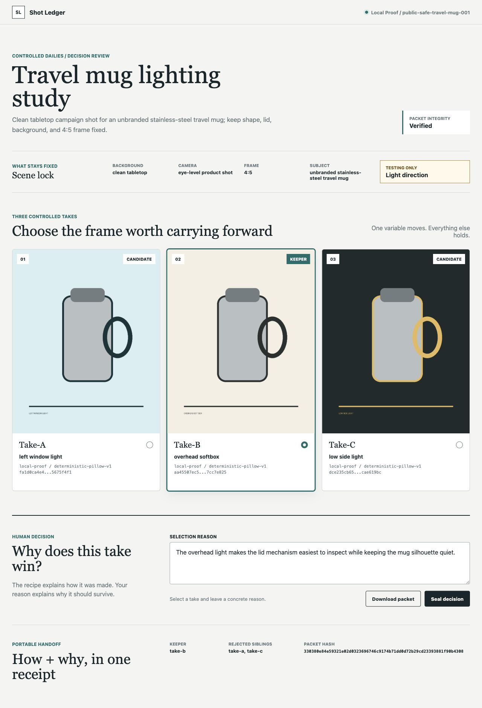
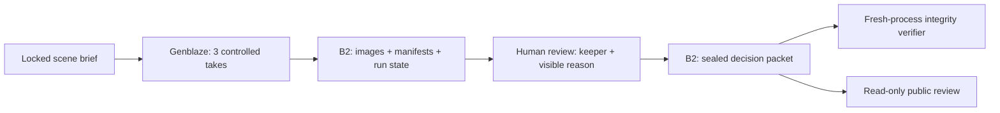

# Shot Ledger

Controlled dailies for generative media.

Shot Ledger gives every approved AI shot a portable handoff that answers two
questions together: **How was this made? Why did we choose it?**



The working product loop is deliberately narrow:

1. Lock one scene brief.
2. Generate three takes while changing one creative variable.
3. Compare the takes side by side.
4. Select one keeper and record the reason.
5. Save the keeper, rejected siblings, Genblaze manifests, hashes, and human
   decision as one B2-backed decision packet.

This repository begins with a local, zero-credential proof of the decision
packet. The contest proof must later execute real generation through Genblaze,
store assets and manifests in Backblaze B2, and reload the ledger from B2.

## Architecture



Generation never chooses the winner. The human decision is sealed only after
the three B2-backed takes can be reviewed, and the public proof cannot mutate
that decision.

## Local Proof

```bash
python3.12 -m venv .venv
.venv/bin/pip install -e '.[dev]'
.venv/bin/python -m shot_ledger.proof_local
.venv/bin/pytest
```

The generated proof is written to `proof/local/`.

## Review Surface

After generating the local proof, start the review app:

```bash
.venv/bin/python -m shot_ledger.server
```

Open `http://127.0.0.1:4173`. The app compares the controlled takes, records a
keeper and concrete selection reason, recomputes the tamper-evident packet, and
exports the complete handoff.

After the real proof exists in B2, run the same app against durable storage:

```bash
export SHOT_LEDGER_STORAGE_MODE=b2
export SHOT_LEDGER_SCENE_ID=public-safe-travel-mug-001
.venv/bin/python -m shot_ledger.server
```

In B2 mode, scene load, private-image reads, decision updates, and packet export
all go through the configured bucket. B2 credentials and expiring signed URLs
are never written into the decision packet.

Public B2 deployments are read-only by default so an anonymous visitor cannot
overwrite the shared keeper. An authenticated operator environment can opt in
to writes with `SHOT_LEDGER_ALLOW_B2_WRITES=true`; local proof mode remains
interactive without that flag.

## Real Genblaze to B2 Proof

The real proof reads credentials only from environment variables. Install the
optional provider and storage packages, configure the names in `.env.example`,
and run:

```bash
.venv/bin/pip install -e '.[dev,real]'
.venv/bin/python -m shot_ledger.real_proof
```

The command generates three controlled takes through Genblaze, stores every
asset and manifest in B2, and downloads the exact B2-backed images to
`proof/real/review/`. It deliberately does not choose a keeper. Review all three
images, then seal the visible human decision:

```bash
.venv/bin/python -m shot_ledger.finalize_real_proof \
  --keeper take-b \
  --reason "The overhead take keeps the rim and handle equally readable."
```

Finalization stores the decision packet, then launches a separate verification
process. That process reloads the packet, all three private image objects, and
all three Genblaze manifests from B2 before it writes
`proof/real/b2-reload-verification.json`.

If one provider call fails, Shot Ledger saves the successful siblings and a
hashed generation-state receipt. Resume with:

```bash
.venv/bin/python -m shot_ledger.retry_real_proof
```

Only failed or pending takes run again; completed takes retain their original
asset and manifest provenance.

## Public Demo Deploy

The Cloudflare Worker in `worker/` serves the review UI while private media and
receipts remain in B2. Its preview deployment uses the explicitly labeled local
proof; the production environment switches to signed, read-only B2 retrieval.
The B2 values are encrypted Worker secrets and are never committed. `render.yaml`
remains a portable Python-host fallback.

- Public preview: https://shot-ledger-preview.gigantic-stranger.workers.dev
- Preview truth label: synthetic local demonstration, not Genblaze or B2 evidence
- Production B2 deployment: pending the real provider proof


## Product Documents

- `docs/SHOT_LEDGER_PRODUCT_BET_2026-07-17.md`
- `docs/SHOT_LEDGER_ONE_DAY_PROOF_CONTRACT_2026-07-17.md`
- `docs/ARCHITECTURE.md`
- `docs/SUBMISSION_EVIDENCE_MATRIX.md`

## Contest

Backblaze Generative Media Hackathon: Build with Genblaze on B2.

- Deadline: August 3, 2026 at 5:00 PM ET
- Required: working app, repository, English description, and public demo under
  three minutes
- Judging: real-world utility, production readiness, B2 orchestration, and
  meaningful Genblaze use, weighted equally
