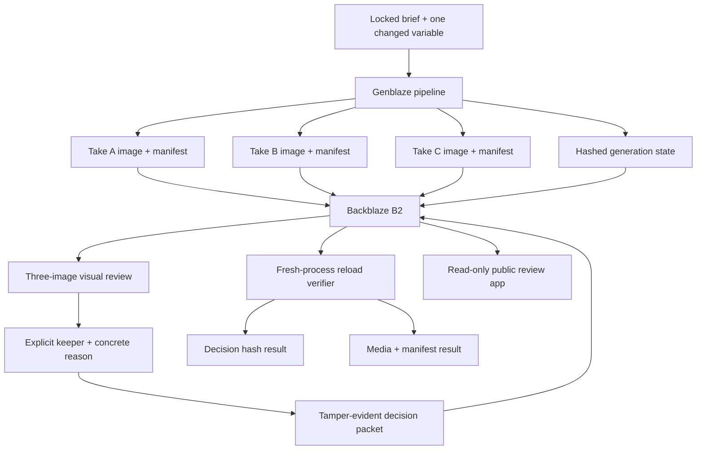

# Shot Ledger Architecture

Shot Ledger separates generation, human approval, and verification so no layer
can quietly impersonate another.

## Durable Objects

| Object | Purpose |
|---|---|
| Three generated images | The actual candidates under review |
| Three Genblaze manifests | Provider, model, prompt, parameters, and provenance |
| Generation state | Attempts, partial failures, preserved successes, and retry scope |
| Decision packet | Keeper, rejected siblings, human reason, and packet hash |
| Reload receipt | Independent verification of decision, media, and manifests from B2 |

## Trust Rules

- Generation stops before keeper selection.
- A partial run cannot be sealed.
- Retry touches only failed or pending takes.
- Decision integrity and media/provenance integrity are reported separately.
- The public deployment is read-only by default.
- Credentials and signed URLs never enter the decision packet.

## Execution Path

1. `python -m shot_ledger.real_proof` generates and stores the three takes.
2. The B2-backed review images are inspected.
3. `python -m shot_ledger.finalize_real_proof` seals an explicit keeper and reason.
4. A separate process reloads all seven proof objects from B2 and writes the verification receipt.
5. The same packet is served through the read-only public review surface.
